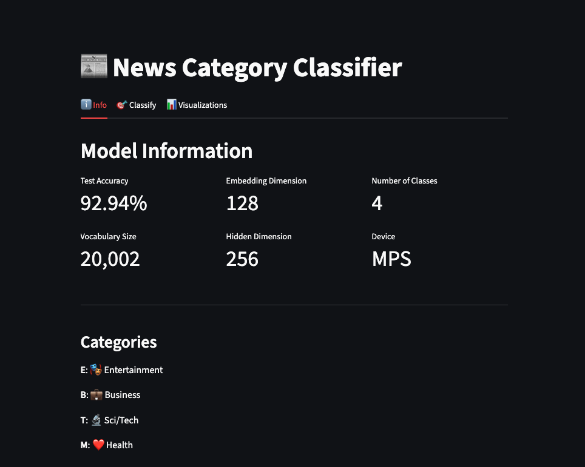
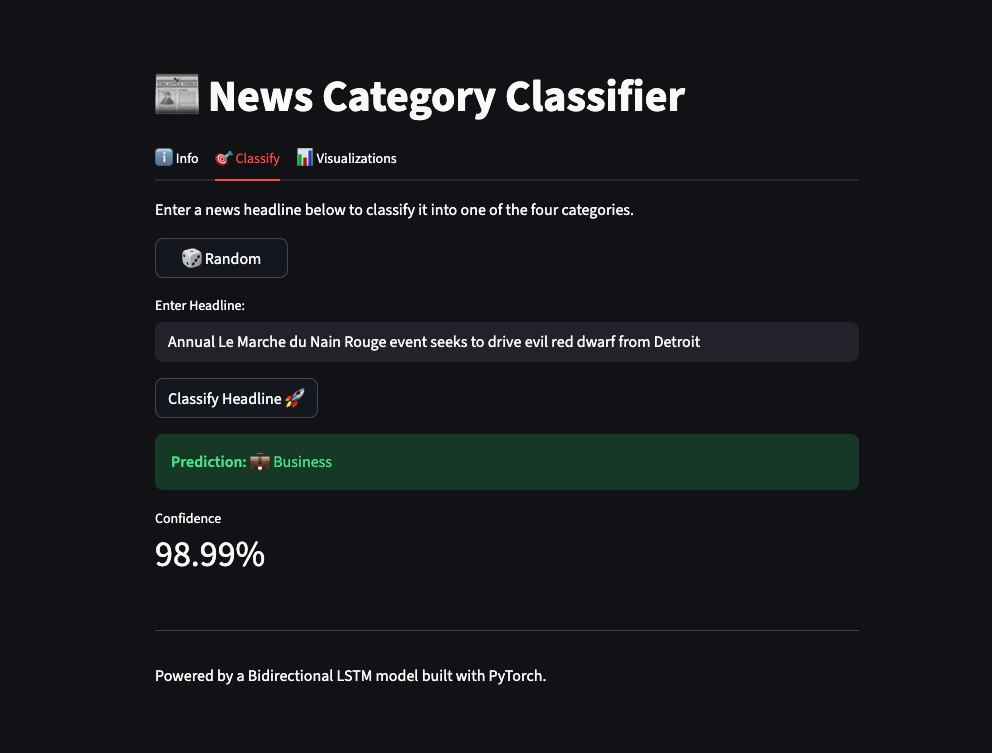
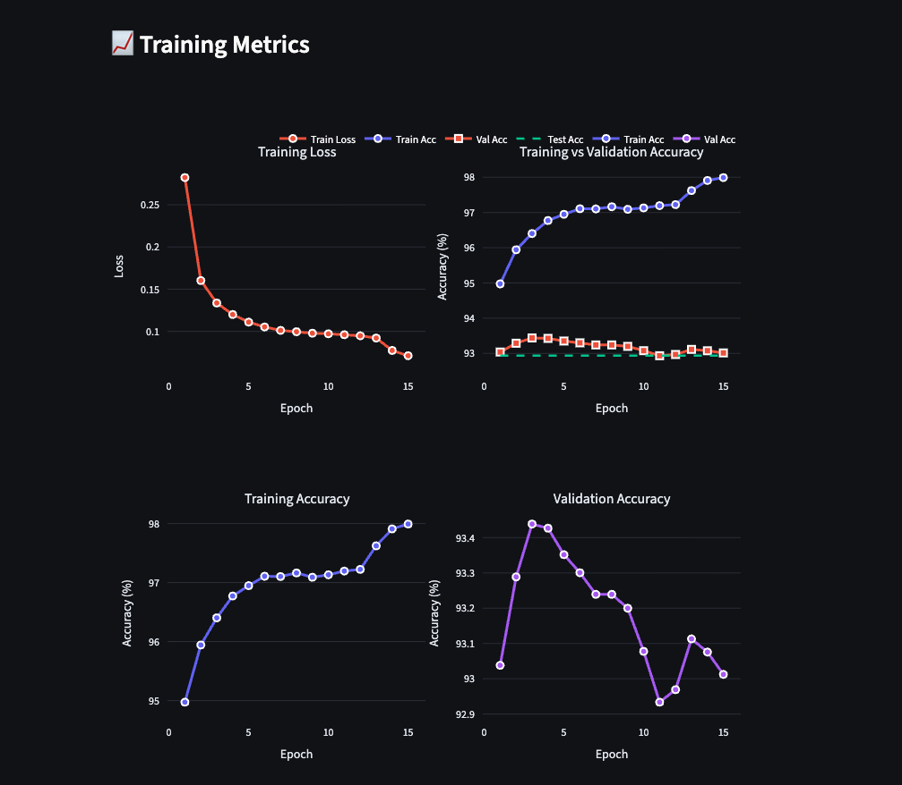

# News Category Classifier

A machine learning project that classifies news headlines into four categories using a Bidirectional LSTM neural network built with PyTorch. The project includes a complete web interface built with Streamlit and a REST API using Flask.

**🌐 Live Demo:** [https://tb-new-headline-classifier.streamlit.app/](https://tb-new-headline-classifier.streamlit.app/)

## 📸 Screenshots

### Home - Model Information

*Comprehensive model statistics, architecture details, and category information*

### Classification Interface

*Interactive classification interface with random headline generation and confidence scores*

### Interactive Visualizations

*Interactive Plotly charts showing data distribution, headline length analysis, and training metrics*

## 📊 Categories

The model classifies news headlines into four categories:
- 🎭 **Entertainment** (E)
- 💼 **Business** (B)
- 🔬 **Sci/Tech** (T)
- ❤️ **Health** (M)

## 🏗️ Project Structure

```
project-lstm/
├── src/
│   ├── model.py          # LSTM model architecture
│   ├── train.py          # Model training script
│   ├── api.py            # Flask REST API
│   └── app.py            # Streamlit web interface
├── data/                 # Dataset files
├── saved_models/         # Trained model artifacts
├── outputs/              # Training outputs
├── notebooks/            # Jupyter notebooks
└── requirements.txt      # Python dependencies
```

## 🛠️ Setup & Installation

### Installation Steps

1. **Clone the repository**
   ```bash
   git clone <repository-url>
   cd news-headline-classifier
   ```

2. **Create virtual environment**
   ```bash
   python -m venv .venv
   source .venv/bin/activate  # On Windows: .venv\Scripts\activate
   ```

3. **Install dependencies**
   ```bash
   pip install -r requirements.txt
   ```

   **Note:** The dataset will be automatically downloaded on first run.

## 🚀 Usage

### Training the Model

Run the training script to train the LSTM model:

```bash
python src/main.py
```

The script will:
- Automatically download the dataset (if not present)
- Load and preprocess the news dataset
- Create data visualizations
- Create train/validation/test splits
- Train the LSTM model
- Save the trained model to `saved_models/`
- Generate training logs in `src/logs/`

### Running the API

Start the Flask API server:

```bash
python src/api.py
```

The API will be available at `http://127.0.0.1:5001`

**API Endpoint:**
- `POST /predict` - Classify a news headline
  ```json
  {
    "text": "Apple announces new iPhone at annual event"
  }
  ```

### Running the Web Interface

Start the Streamlit web application:

```bash
streamlit run src/app.py
```

The web interface will open in your browser, allowing you to:
- Enter news headlines for classification
- View predicted categories with confidence scores
- Interactive and user-friendly interface

## 🧠 Model Architecture

The model uses a **Bidirectional LSTM** architecture:

- **Embedding Layer**: Converts text tokens to dense vectors
- **Bidirectional LSTM**: 2-layer LSTM that processes text in both directions
- **Dropout**: Regularization to prevent overfitting
- **Fully Connected Layer**: Final classification layer

**Key Features:**
- Handles variable-length sequences with padding
- Bidirectional processing for better context understanding
- Dropout regularization for improved generalization

## 📈 Model Performance

The model is trained on a large news dataset with the following configuration:
- Vocabulary size: 20,000 words
- Embedding dimension: 128
- Hidden dimension: 256
- Learning rate: 0.005
- Batch size: 128
- Epochs: 10
- Device: Automatically selects CUDA > MPS > CPU

## 🔧 Technical Stack

- **PyTorch**: Deep learning framework
- **torchtext**: Text preprocessing and data loading
- **Streamlit**: Web interface framework
- **Flask**: REST API framework
- **spaCy**: Natural language processing
- **scikit-learn**: Model evaluation metrics
- **pandas**: Data manipulation
- **matplotlib/seaborn**: Visualization

## 📁 Data

The project uses the UCI News Aggregator dataset containing news headlines from various sources. The data is split into:
- Training set: 80%
- Validation set: 10%
- Test set: 10%

## 🎯 Features

- **Real-time prediction**: Instant classification of news headlines
- **Web interface**: User-friendly Streamlit application
- **REST API**: Programmatic access via Flask API
- **Model persistence**: Trained models are saved and can be reloaded
- **Confidence scores**: Probability estimates for predictions
- **Multi-device support**: Automatically uses CUDA, MPS (Apple Silicon), or CPU
- **Responsive design**: Clean and intuitive user interface

## 🚦 Getting Started

### Quick Start

**Try the live demo:**
Visit **[https://tb-new-headline-classifier.streamlit.app/](https://tb-new-headline-classifier.streamlit.app/)** to use the application immediately without any setup!

**Or run locally:**
```bash
# Clone the repository
git clone https://github.com/yourusername/news-headline-classifier.git
cd news-headline-classifier

# Install dependencies
pip install -r requirements.txt

# Train the model
python src/main.py

# Launch the web app
streamlit run src/app.py
```

### Manual Setup
1. **Clone the repository** and navigate to the project directory
2. **Install dependencies** with `pip install -r requirements.txt`
3. **Train the model** by running `python src/main.py` (downloads dataset automatically)
4. **Launch the Streamlit app** with `streamlit run src/app.py`
5. **Enter a news headline** and get instant classification results with interactive visualizations!

## 📝 Requirements

- Python 3.7+
- PyTorch 2.0.0+
- torchtext 0.6.0
- Streamlit 1.28.0+
- Plotly 5.14.0+
- See `requirements.txt` for complete dependency list

## 🚀 Deployment

### Streamlit Cloud

The application is deployed on Streamlit Cloud and can be accessed at:
**[https://tb-new-headline-classifier.streamlit.app/](https://tb-new-headline-classifier.streamlit.app/)**

### Local Deployment

**Clone and run locally:**
```bash
git clone https://github.com/yourusername/news-headline-classifier.git
cd news-headline-classifier
pip install -r requirements.txt
python src/main.py  # Train the model first
streamlit run src/app.py
```

## 🤝 Contributing

Feel free to open issues and submit pull requests to improve the project.

## 📄 License

This project is open source and available under the MIT License.